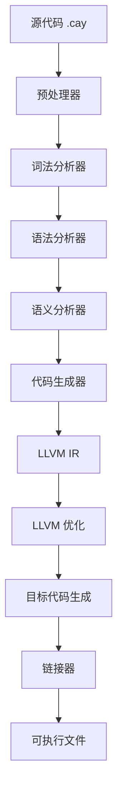

# Cavvy 项目代码百科

## 1. 项目概览

Cavvy (Cay) 是一个静态类型的面向对象编程语言，编译为原生机器码，无运行时依赖，无 VM，无 GC。

### 核心特性
- 🚀 **原生性能**：编译为 Windows EXE / Linux ELF，零开销抽象
- 🛡️ **内存安全**：显式内存管理，RAII 模式支持
- ☕ **Java 风格语法**：熟悉的面向对象编程体验
- 🔧 **完整工具链**：从源码到可执行文件的一站式编译
- 🌉 **FFI 支持**：无缝调用 C 函数和系统库
- 📦 **字节码系统**：支持 `.caybc` 格式和代码混淆

### 技术栈
- **前端**：Rust 实现的词法分析、语法分析、语义分析
- **中端**：LLVM IR 代码生成
- **后端**：MinGW-w64 / GCC 工具链
- **字节码**：自定义 CayBC 格式（基于栈的虚拟机）

## 2. 项目结构

```
cavvy/
├── src/                    # 源代码
│   ├── bin/               # 可执行文件
│   │   ├── cayc.rs        # 一站式编译器
│   │   ├── cay-ir.rs      # Cavvy → IR 编译器
│   │   ├── ir2exe.rs      # IR → EXE 编译器
│   │   ├── cay-check.rs   # 语法检查工具
│   │   ├── cay-run.rs     # 直接运行工具
│   │   ├── cay-bcgen.rs   # 字节码生成器
│   │   ├── cay-lsp.rs     # LSP 语言服务器
│   │   └── cay-idle.rs    # 图形化 IDE
│   ├── lexer/             # 词法分析器
│   ├── parser/            # 语法分析器
│   ├── semantic/          # 语义分析器
│   ├── codegen/           # 代码生成器
│   ├── bytecode/          # 字节码系统
│   ├── preprocessor/      # 预处理器
│   ├── rcpl/              # 资源编译
│   ├── idle/              # GUI IDE
│   ├── ast.rs             # AST 定义
│   ├── types.rs           # 类型系统
│   └── error.rs           # 错误处理
├── examples/              # 示例程序
├── caylibs/               # 标准库
├── docs/                  # 文档
├── tests/                 # 测试套件
└── Cargo.toml             # Rust 项目配置
```

## 3. 编译器架构

### 编译流程

1. **预处理**：处理 `#define`、`#include` 等预处理器指令
2. **词法分析**：将源代码转换为令牌流
3. **语法分析**：构建抽象语法树 (AST)
4. **语义分析**：类型检查、符号解析、继承关系验证
5. **代码生成**：生成 LLVM IR 中间代码
6. **优化**：应用 LLVM 优化
7. **链接**：生成最终可执行文件

### 核心模块关系



## 4. 核心模块详解

### 4.1 词法分析器 (Lexer)

词法分析器负责将源代码文本转换为令牌流。

**主要功能**：
- 识别关键字、标识符、字面量、运算符等
- 处理注释（单行和多行）
- 跟踪源代码位置信息
- 错误诊断和修复建议

**关键文件**：
- [src/lexer/mod.rs](file:///workspace/src/lexer/mod.rs)

**核心类/函数**：
- `Token`：定义所有可能的令牌类型
- `Lexer`：词法分析器实现
- `lex()`：主词法分析函数

### 4.2 语法分析器 (Parser)

语法分析器将令牌流转换为抽象语法树 (AST)。

**主要功能**：
- 解析类、接口、方法、语句、表达式
- 构建层次化的 AST 结构
- 语法错误检测和详细的错误信息

**关键文件**：
- [src/parser/mod.rs](file:///workspace/src/parser/mod.rs)
- [src/parser/classes.rs](file:///workspace/src/parser/classes.rs)
- [src/parser/statements.rs](file:///workspace/src/parser/statements.rs)
- [src/parser/expressions.rs](file:///workspace/src/parser/expressions.rs)

**核心类/函数**：
- `Parser`：语法分析器实现
- `parse()`：主语法分析函数
- `parse_class()`：解析类定义
- `parse_method()`：解析方法定义
- `parse_expression()`：解析表达式

### 4.3 语义分析器 (Semantic Analyzer)

语义分析器负责类型检查和语义验证。

**主要功能**：
- 类型检查和类型推断
- 符号表管理
- 继承关系验证
- `@Override` 注解验证
- 方法重载解析

**关键文件**：
- [src/semantic/analyzer.rs](file:///workspace/src/semantic/analyzer.rs)
- [src/semantic/class_analysis.rs](file:///workspace/src/semantic/class_analysis.rs)
- [src/semantic/type_check.rs](file:///workspace/src/semantic/type_check.rs)

**核心类/函数**：
- `SemanticAnalyzer`：语义分析器实现
- `analyze()`：主语义分析函数
- `type_check_program()`：程序类型检查
- `check_inheritance()`：继承关系检查

### 4.4 代码生成器 (Code Generator)

代码生成器将 AST 转换为 LLVM IR 中间代码。

**主要功能**：
- 生成 LLVM IR 代码
- 处理类布局和内存管理
- 生成方法和构造函数
- 处理静态初始化
- 平台特定代码生成

**关键文件**：
- [src/codegen/generator.rs](file:///workspace/src/codegen/generator.rs)
- [src/codegen/context.rs](file:///workspace/src/codegen/context.rs)
- [src/codegen/expressions/](file:///workspace/src/codegen/expressions/)
- [src/codegen/statements/](file:///workspace/src/codegen/statements/)

**核心类/函数**：
- `IRGenerator`：代码生成器实现
- `generate()`：主代码生成函数
- `generate_method()`：生成方法代码
- `generate_constructor()`：生成构造函数代码
- `type_to_llvm()`：类型转换

### 4.5 字节码系统 (Bytecode)

字节码系统实现了 Cavvy 字节码的生成和执行。

**主要功能**：
- 字节码序列化和反序列化
- 字节码混淆
- JIT 执行
- 常量池管理

**关键文件**：
- [src/bytecode/mod.rs](file:///workspace/src/bytecode/mod.rs)
- [src/bytecode/instructions.rs](file:///workspace/src/bytecode/instructions.rs)
- [src/bytecode/serializer.rs](file:///workspace/src/bytecode/serializer.rs)

### 4.6 预处理器 (Preprocessor)

预处理器处理源代码中的预处理指令。

**主要功能**：
- 处理 `#define` 和 `#undef`
- 处理 `#include` 指令
- 处理条件编译（`#ifdef`, `#ifndef`, `#if`, `#else`, `#endif`）

**关键文件**：
- [src/preprocessor/mod.rs](file:///workspace/src/preprocessor/mod.rs)

### 4.7 LSP 语言服务器 (LSP)

LSP 服务器为 IDE 提供语言服务。

**主要功能**：
- 语法高亮
- 代码补全
- 错误诊断
- 跳转到定义
- 代码格式化

**关键文件**：
- [src/bin/cay-lsp.rs](file:///workspace/src/bin/cay-lsp.rs)

### 4.8 GUI IDE (Cay-Idle)

Cay-Idle 是 Cavvy 的图形化集成开发环境。

**主要功能**：
- 代码编辑器
- 项目管理
- 语法检查
- 直接运行
- 文件浏览器

**关键文件**：
- [src/idle/mod.rs](file:///workspace/src/idle/mod.rs)
- [src/idle/editor.rs](file:///workspace/src/idle/editor.rs)
- [src/bin/cay-idle.rs](file:///workspace/src/bin/cay-idle.rs)

## 5. 工具链

### 5.1 cayc - 一站式编译器

**功能**：将 Cavvy 源代码直接编译为可执行文件

**用法**：
```bash
cayc source.cay output.exe
```

**关键文件**：
- [src/bin/cayc.rs](file:///workspace/src/bin/cayc.rs)

### 5.2 cay-ir - IR 编译器

**功能**：将 Cavvy 源代码编译为 LLVM IR

**用法**：
```bash
cay-ir source.cay output.ll
```

**关键文件**：
- [src/bin/cay-ir.rs](file:///workspace/src/bin/cay-ir.rs)

### 5.3 ir2exe - 编译器后端

**功能**：将 LLVM IR 编译为可执行文件

**用法**：
```bash
ir2exe input.ll output.exe
```

**关键文件**：
- [src/bin/ir2exe.rs](file:///workspace/src/bin/ir2exe.rs)

### 5.4 cay-check - 语法检查工具

**功能**：检查 Cavvy 源代码的语法

**用法**：
```bash
cay-check source.cay
```

**关键文件**：
- [src/bin/cay-check.rs](file:///workspace/src/bin/cay-check.rs)

### 5.5 cay-run - 直接运行工具

**功能**：直接运行 Cavvy 源代码（不生成可执行文件）

**用法**：
```bash
cay-run source.cay
```

**关键文件**：
- [src/bin/cay-run.rs](file:///workspace/src/bin/cay-run.rs)

### 5.6 cay-bcgen - 字节码生成器

**功能**：生成 Cavvy 字节码文件

**用法**：
```bash
cay-bcgen source.cay output.caybc
```

**关键文件**：
- [src/bin/cay-bcgen.rs](file:///workspace/src/bin/cay-bcgen.rs)

## 6. 核心 API 和类

### 6.1 编译器核心 API

**Compiler 类**
- **功能**：编译器主类，协调编译过程
- **方法**：
  - `compile()`：编译源代码为 LLVM IR
  - `compile_file()`：从文件编译
  - `compile_with_source_map()`：带源映射的编译

**关键文件**：
- [src/lib.rs](file:///workspace/src/lib.rs)

### 6.2 类型系统

**Type 枚举**
- **功能**：表示所有可能的类型
- **成员**：
  - `Void`：空类型
  - `Int32`：32位整数
  - `Int64`：64位整数
  - `Float32`：32位浮点数
  - `Float64`：64位浮点数
  - `Bool`：布尔型
  - `Char`：字符型
  - `String`：字符串
  - `Array`：数组
  - `Class`：类类型
  - `Interface`：接口类型

**关键文件**：
- [src/types.rs](file:///workspace/src/types.rs)

### 6.3 AST 节点

**Program 结构体**
- **功能**：表示完整的程序
- **成员**：
  - `classes`：类声明列表
  - `interfaces`：接口声明列表
  - `top_level_functions`：顶层函数列表
  - `extern_declarations`：外部函数声明列表

**关键文件**：
- [src/ast.rs](file:///workspace/src/ast.rs)

### 6.4 语义分析

**SemanticSymbolTable 类**
- **功能**：管理符号表
- **方法**：
  - `enter_scope()`：进入作用域
  - `exit_scope()`：退出作用域
  - `declare()`：声明符号
  - `resolve()`：解析符号

**关键文件**：
- [src/semantic/symbol_table.rs](file:///workspace/src/semantic/symbol_table.rs)

## 7. 技术实现细节

### 7.1 内存管理

Cavvy 采用显式内存管理，通过 RAII 模式确保资源正确释放。

- **栈分配**：局部变量和基本类型
- **堆分配**：对象和数组（使用 `new` 关键字）
- **析构函数**：自动调用以释放资源

### 7.2 类型系统

Cavvy 具有静态类型系统，支持：

- **基本类型**：int, long, float, double, boolean, char, String
- **复合类型**：类、接口、数组
- **类型推断**：使用 `auto` 关键字
- **类型转换**：显式和隐式转换

### 7.3 面向对象特性

Cavvy 支持完整的面向对象编程特性：

- **类和继承**：单继承模型
- **接口**：多接口实现
- **访问控制**：public, private, protected
- **抽象类和方法**：使用 abstract 关键字
- **Final 类和方法**：防止继承和重写
- **构造函数和析构函数**：对象初始化和清理

### 7.4 FFI 支持

Cavvy 提供 FFI（外部函数接口）以调用 C 函数：

```cay
extern {
    int abs(int x);
    double sqrt(double x);
}
```

支持多种调用约定：
- cdecl
- stdcall
- fastcall
- sysv64
- win64

### 7.5 字节码系统

Cavvy 实现了自定义的字节码格式（CayBC）：

- **基于栈的虚拟机**
- **常量池**：存储字符串和常量
- **指令集**：包含所有必要的操作
- **混淆支持**：防止逆向工程

## 8. 平台支持

### 8.1 支持的平台

- **Windows**：Windows 10/11 x64
- **Linux**：x86_64 Linux 发行版

### 8.2 平台特定实现

- **Windows**：使用 MinGW-w64 工具链
- **Linux**：使用 GCC 工具链
- **跨平台差异**：通过 `PlatformAbstraction` 处理

## 9. 构建和运行

### 9.1 从源码构建

```bash
# 克隆仓库
git clone https://github.com/Ethernos-Studio/Cavvy.git
cd Cavvy

# 构建编译器（Release 模式）
cargo build --release

# 运行测试
cargo test --release
```

### 9.2 系统要求

- **Windows**：Windows 10/11 x64
- **Linux**：x86_64 Linux 发行版
- **依赖**：LLVM 17.0+, MinGW-w64 13.2+ (Windows)

### 9.3 编译选项

```bash
# 基础编译
cayc hello.cay hello.exe

# 优化级别
cayc -O3 hello.cay hello.exe        # 最高优化
cayc -O0 hello.cay hello.exe        # 无优化（调试）

# 字节码混淆
cayc --obfuscate --obfuscate-level deep hello.cay hello.exe

# 链接库
cayc -lm hello.cay hello.exe        # 链接数学库

# 跨平台目标
cay-ir --target x86_64-linux-gnu hello.cay hello.ll
```

## 10. 代码示例

### 10.1 基础程序

```cay
public class Hello {
    public static void main() {
        println("Hello, World!");
    }
}
```

### 10.2 面向对象示例

```cay
public class Animal {
    protected String name;
    
    public Animal(String name) {
        this.name = name;
    }
    
    public void speak() {
        println("Some sound");
    }
}

public class Dog extends Animal {
    public Dog(String name) {
        super(name);
    }
    
    @Override
    public void speak() {
        println(name + " says: Woof!");
    }
}
```

### 10.3 FFI 示例

```cay
extern {
    int abs(int x);
    double sqrt(double x);
}

public class MathExample {
    public static void main() {
        int result = abs(-42);
        double root = sqrt(2.0);
        println("Abs: " + result);
        println("Sqrt: " + root);
    }
}
```

## 11. 开发状态

### 11.1 当前版本

**版本 0.4.8**

### 11.2 已完成功能

- [x] 基础类型系统
- [x] 变量声明和赋值
- [x] 算术、比较、逻辑、位运算符
- [x] 控制流语句（if-else, switch, loops）
- [x] 数组（一维和多维）
- [x] 字符串操作
- [x] 类型转换
- [x] 方法重载和可变参数
- [x] Lambda 表达式和方法引用
- [x] 类和单继承
- [x] 抽象类和接口
- [x] 访问控制
- [x] 构造函数和析构函数
- [x] Final 类和方法
- [x] 静态成员和初始化
- [x] @Override 注解
- [x] 顶层 main 函数
- [x] FFI 外部函数接口
- [x] 自动链接器
- [x] 字节码系统 (CayBC)
- [x] 代码混淆
- [x] LSP 语言服务器
- [x] Windows / Linux 跨平台支持

### 11.3 开发路线图

**即将推出 (0.5.x):**
- 分配器接口和 Arena 分配器
- 泛型集合 (ArrayList, HashMap)
- 智能指针 (UniquePtr, ScopedPtr)
- Result<T, E> 错误处理
- 操作系统线程封装

## 12. 故障排除

### 12.1 常见错误

| 错误类型 | 可能原因 | 解决方案 |
|---------|---------|---------|
| 语法错误 | 代码语法不正确 | 检查语法，参考语法规则 |
| 类型错误 | 类型不匹配 | 检查变量类型和函数参数类型 |
| 链接错误 | 缺少库或符号 | 确保正确链接必要的库 |
| 内存错误 | 内存管理问题 | 检查对象生命周期和资源释放 |

### 12.2 调试技巧

- 使用 `cay-check` 进行语法检查
- 使用 `-O0` 编译选项进行调试
- 检查编译器输出的错误信息
- 使用 `print`/`println` 语句进行调试

## 13. 贡献指南

### 13.1 提交 Issue

- **Bug 报告**：使用 GitHub Issues
- **功能建议**：查看 ROADMAP.md 后提交 PR
- **文档改进**：直接编辑文档并提交

### 13.2 代码风格

- 遵循 Rust 代码风格
- 使用 4 空格缩进
- 变量和函数命名使用蛇形命名法
- 类型和模块命名使用驼峰命名法

## 14. 许可证

本项目采用 GPL3 许可证。详见 [LICENSE](file:///workspace/LICENSE) 文件。

## 15. 致谢

- [LLVM Project](https://llvm.org/)
- [MinGW-w64](https://www.mingw-w64.org/)
- [Rust Programming Language](https://www.rust-lang.org/)

---

**Cavvy - 编译未来**